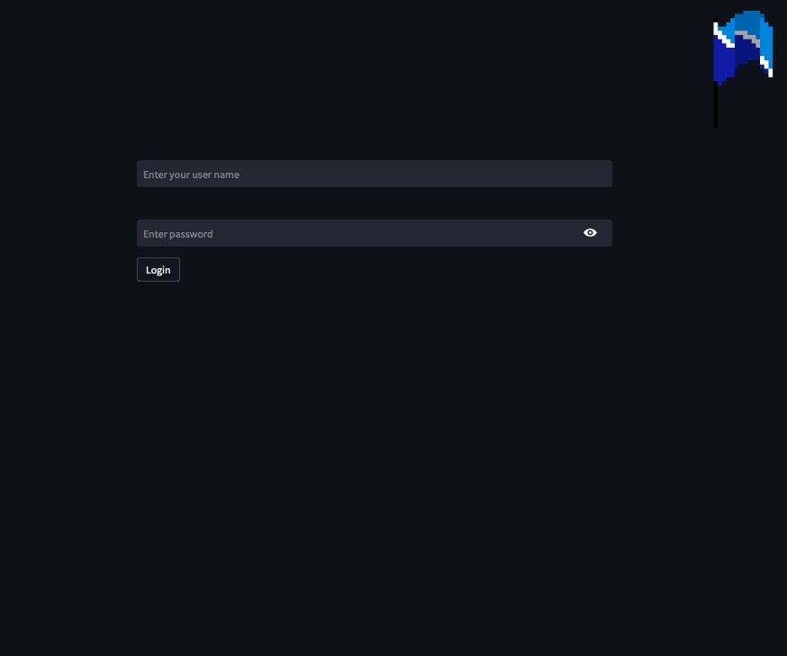
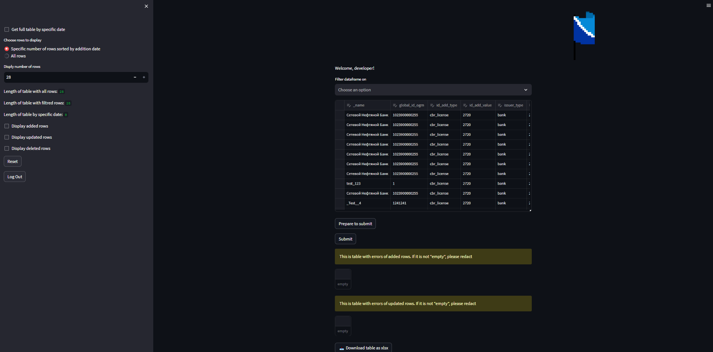
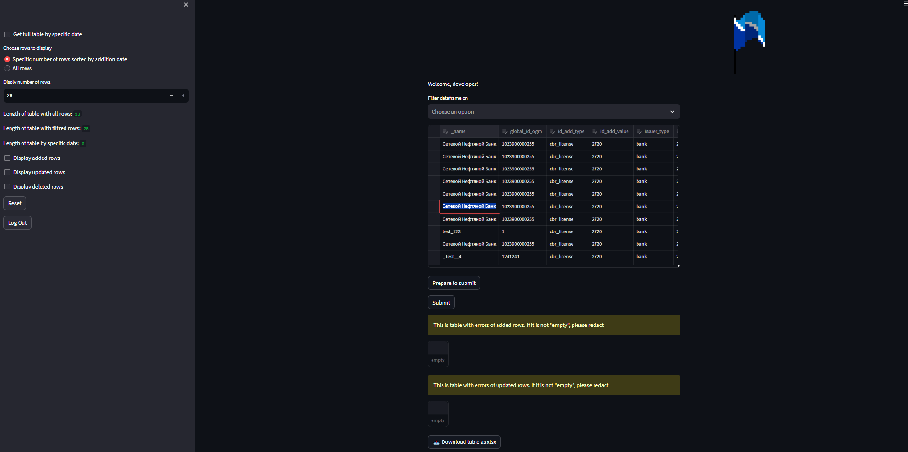
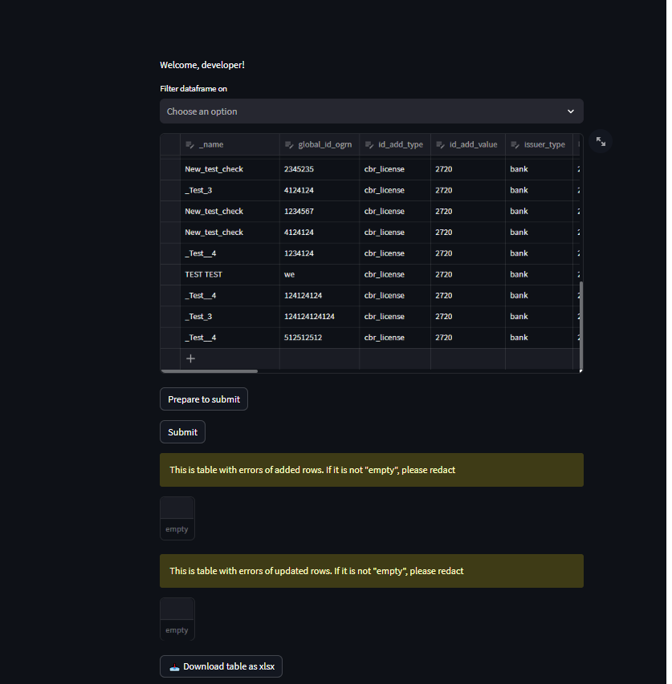
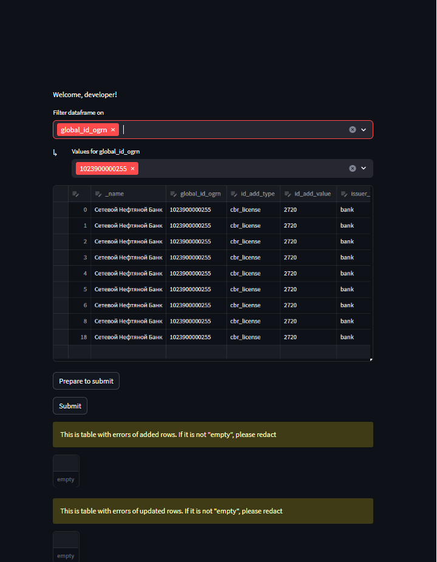
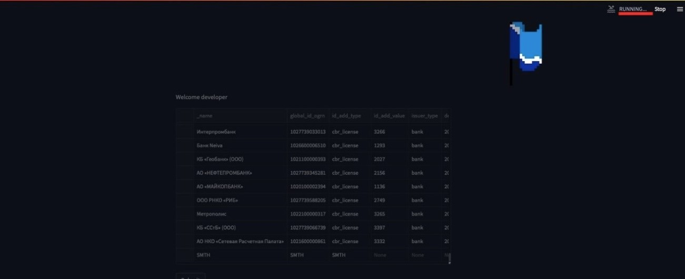
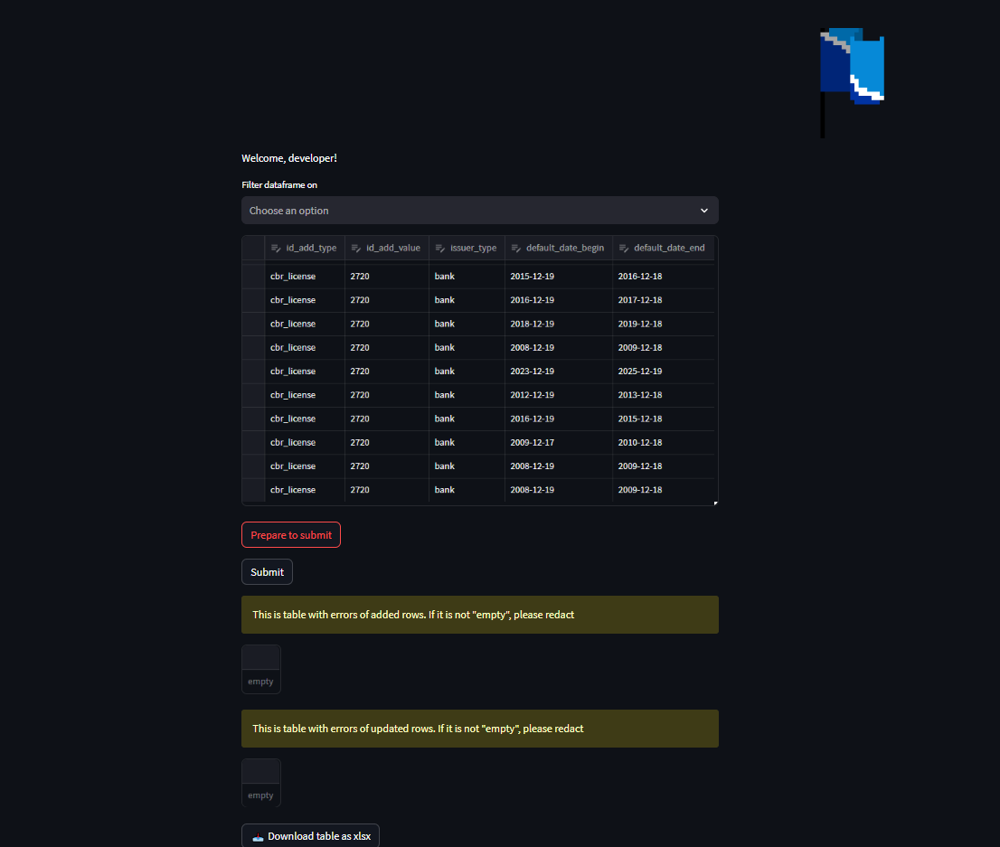
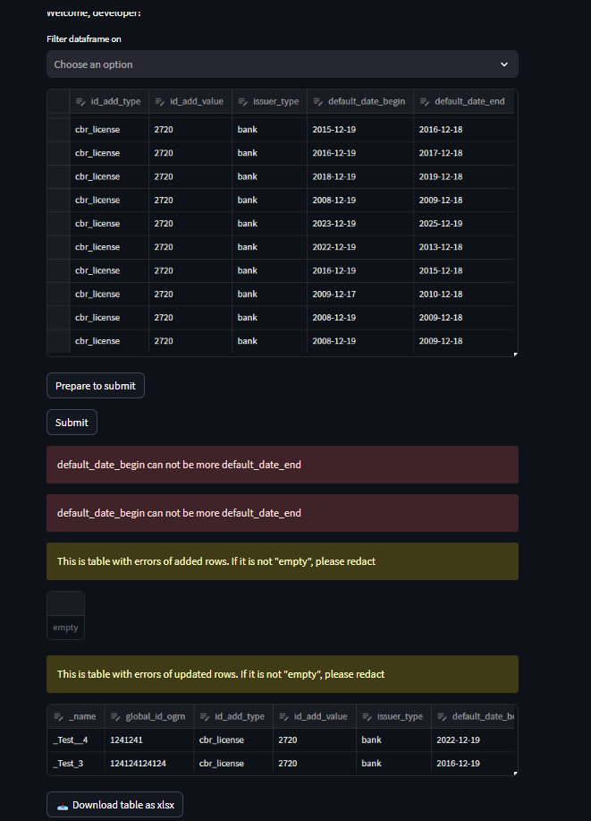
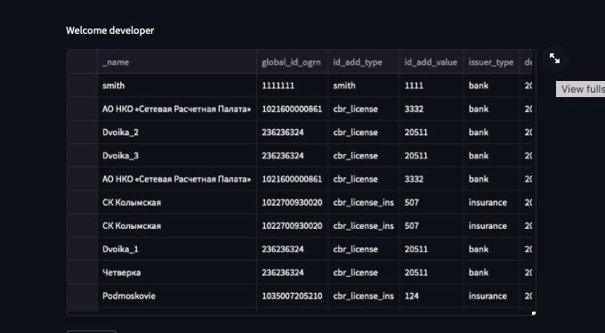

# Как пользоваться web-интерфейсов для редактирования таблицы дефолтов

Web-интерфейс предназначен для редактирования таблицы, не требует предварительной настройки рабочего места (в т.ч. установленного MS Access)
	Обеспечивает первичную проверку данных на корректность, снижает вероятность операционных ошибок при вводе данных, выводит базовую информацию о состоянии целевой таблицы.\
	Обеспечивает авторизацию и аутентификацию пользователей на основе уже существующих пар логин/пароль от основной базы данных.
1) Перейдите по ссылке из сообщения.\
	(Перейдя по ссылке отобразится окно авторизации.\
	 В нем необходимо ввести логин/пароль от основной базы данных)

2) После авторизации будет загружена основная страница с таблицей дефолтов слева отображена панель с основными командами):
    ---"Get full table by specific date” позволяет вывести таблицу по состоянию на определенную дату (дублирует функционал витрины дефолтов).\
    ---"Choose rows to display” позволяет выбрать кол-во строк для отображения (по умолчанию выводится 100 последних записей).\
    ---"Display added rows” позволяет просмотреть добавленные записи.\
    ---"Display updated rows” позволяет просмотреть отредактированные записи.\
    ---"Display deleted rows” позволяет просмотреть индексы удаленных записей.\
    ---Так же указываются 5 последних изменений в таблице, кем они были осуществлены, когда и что за изменения.

3) Основная таблица позволяет вносить изменения в существующие записи, добавлять строки, удалять их.\
    Двойное нажатие ЛКМ по ячейке подсветит её и позволит вносить изменения.

    Пролистав до самого низа таблицы, можно добавлять новые строки(нажать на значок +).\
    Достаточно так же двойным нажатием ЛКМ добавить в ячейку значение, либо вставить строку(Однако вставка напрямую из Excel требует пользовательского вмешательства, чтобы данные не "съехали" в соседний столбец).\

    Слева от столбца _name необходимо нажать на пустое поле, чтобы выбрать строку для удаления (само удаление – по клавише Del клавиатуры). 
    Следует внимательно проверить на необходимость удаление данной записи из базы данных. 
    В случае, если удаляется новая строка, то никаких изменений в БД не происходит.
    В случае, если удаление было ошибочным, необходимо нажать на кнопку “Reset”(или не нажимать “Prepare to submit”)
    Страница обновится, но внесенные изменения не сохранятся.

4) Доступна фильтрация данных по всем столбцам и значениям.\
    Достаточно в поле на таблицей (Filter dataframe on) выбрать столбец и в поле "Values for ..." указать значения.\
    

5) После взаимодействий с таблицей страница начнет автоматически прогружаться.\
    Для минимизации потери внесенных данных, следует дождаться её загрузки(не более 5-10с.).\

    После того, как страница прогрузится необходимо нажать на кнопку “Prepare to submit”, не меняя текущую таблицу(в случае если были использованы любые фильтры)

    После всех необходимых действий, необходимо нажать на кнопку 'Submit' и произойдет процесс переноса новых данных в базу данных. 
    По завершении этого процесса появятся уведомления об успешном выполнении или будут отражены системные ошибки и "плохие данные" перенесутся в таблицы ниже.\
    Это таблицы редактирования добавленных и измененных данных, которые не прошли проверку на стороне БД.\
    NB: действия пользователя будут помещены в лог, который ведется средствами базы данных.

	

5) Скачивание таблиц на выбранную дату происходит посредством нажатия на кнопку 'Download table as xlsx' / 'Download table as csv'.\
    В случае, если дата не выбрана, можно автоматически скачать всю выгрузку, отображаемую на текущей странице.
6) Дополнительно:\
    При необходимости увеличить таблицу, надо нажать на соответствующую кнопку расширения в правом верхнем углу таблицы.\

    
    Так же для поиска по конкретному значению в таблице можно использовать сочетание клавиш Ctrl и F.

9) Вставка из Excel.\
При необходимости вставить данные из Excel, нужно проверить столбцы на непустые значения, в противном случае данные перенесутся со сдвигом в соседний столбец.\
(Пример заполнения строки из Excel находится в доп. Файле)\
Предварительно стоит записать в пустые ячейки любые значения, чтобы на сервере их уже исправить.\
Так же значения ИСТИНА/ЛОЖЬ необходимо заранее перевести в 0/1 или False/True, чтобы сервер смог их инициализировать.

	